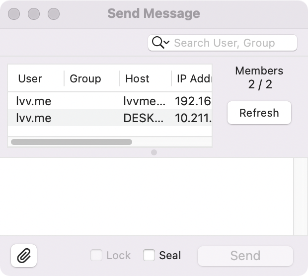
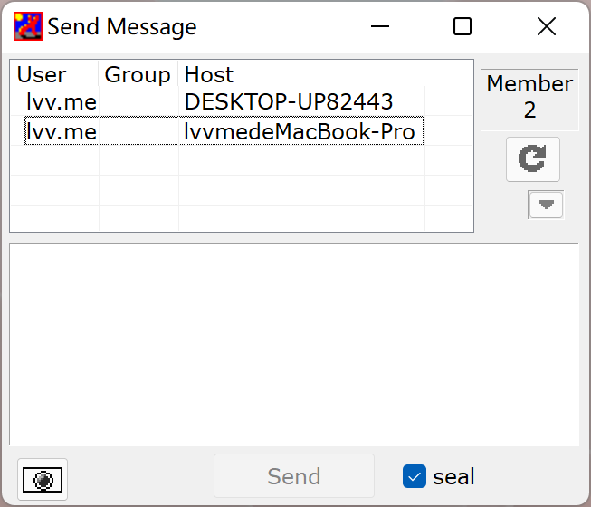

# IP Messenger for macOS

“IP Messenger for macOS” is a pop up style message communication software for multi platforms.

It’s a port of [Windows Version](https://www.ipmsg.org/).

Compatible with Windows version.

## Licence

This software is licensed according to the [BSD Licence](https://en.wikipedia.org/wiki/BSD_license).
